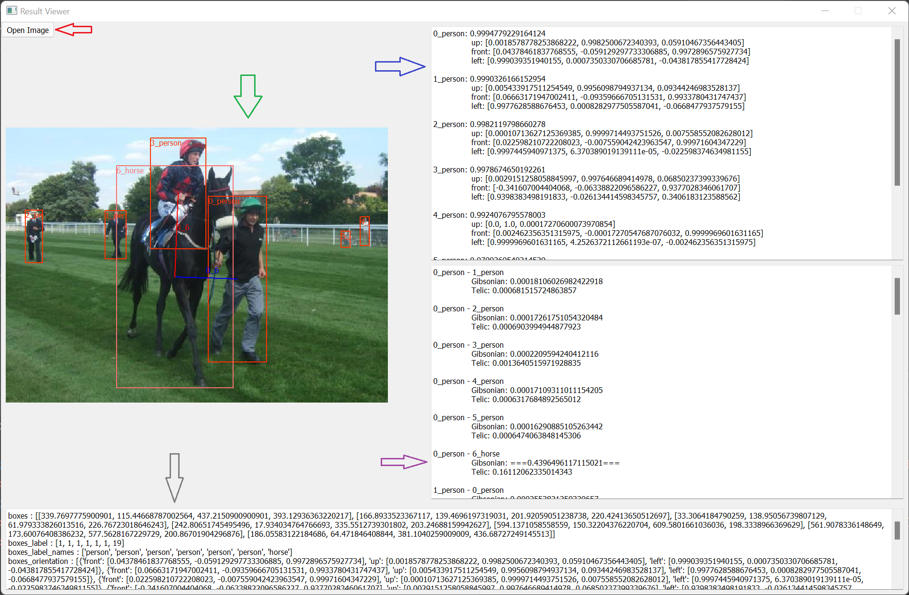

# Habitat Extractor Tool
 
## Info
This project is heavily based on the following projects:
* UPT: https://github.com/fredzzhang/upt?ref=pythonrepo.com
* PoseContrast: https://github.com/YoungXIAO13/PoseContrast

## Setup

### Python enviroment
* https://docs.conda.io/en/latest/miniconda.html
* conda create -n "habitat" python=3.8
* conda activate habitat
* install pytorch: https://pytorch.org/
* pip install -r requirements.txt
* (Maybe 1-2 libraries are still missing. In this case please add them or let me know.)

 
* To use this tool, download the following models:
  * UPT Model from https://hessenbox-a10.rz.uni-frankfurt.de/dl/fi2jNX5TxJB1f5qbiZzRQnVU/robust-sweep-8_ckpt_41940_20.pt  (--hoi_model)
  * PoseContrast_ObjectNet3D_FewShot from https://github.com/YoungXIAO13/PoseContrast (--pose_model)
  

### Predict Folder
* python process_image_folder.py --input_folder "data/test_images" --output_file "results.json"
  * Predicts the results for every image in "test_images" and writes the results in "results.json"
  
#### Parameters
* input_folder: Path to Image Folder
* output_file: Output File
* device: Define GPU Device (-1 for CPU. Not tested.)
* box_score_thresh: Threshold for Object Detection
* hoi_model: Path to UPT Model
* pose_model: Path to ContrastPose Model

#### Results

```python
results =  {"boxes": [[5, 5, 10, 10], [2, 3, 4, 5], [4, 8, 6, 7]], # BBoxes
           "boxes_label": [1, 19, 32], # BBox Label IDs
           "boxes_label_names": ["person", "horse", "tie"], # BBox Label Names
           "boxes_orientation": [{"front": [0, 0, 1], "left": [1, 0, 0], "up": [0, 1, 0]}, {...}, {...}], # BBox Object Orientations
           "boxes_scores": [0.9, 0.5, 0.6],
           "pairing": [[0, 0, 0, 0], [1, 1, 2, 2]], #BBox HOI Pairing -> Pairs = (0, 1) and (0, 2). In the first list are only human ids.
           "pairing_label": [0, 1, 0, 1], # : Gibsonian, 1: Telic
           "pairing_scores": [0.53, 0.67, 0.12, 0.09] # Scores for pairing_label
           }

''' *Interpretation*
[5, 5, 10, 10] = human with probability 0.9
[2, 3, 4, 5] = horse with probability 0.5
[4, 8, 6, 7] = tie with probability 0.6

human - horse: 0.53 Gibsonian and 0.67 Telic
human - tie: 0.12 Gibsonian and 0.09 Telic
'''
```

### Image Visualizer
* python process_image_folder.py
  * Starts an App for visualizing all results for selected images.
  
#### Parameters
* device: Define GPU Device (-1 for CPU. Not tested.)
* box_score_thresh: Threshold for Object Detection
* hoi_score_thresh: Threshold for displaying HOIs
* hoi_model: Path to UPT Model
* pose_model: Path to ContrastPose Model

#### Results

* Red arrow: Opens a new image.
* Green arrow: Selected image with all detected bboxes (via box_score_thresh) and hois (via hoi_score_thresh).
  * ID and labels are in the upper left corner.
  * Red HOI connection: Telic
  * Blue HOI connection: Gibsonian
* Blue arrow: object box. All detected objects (via box_score_thresh) including their detected orientations.
* Purple arrow: HOI box. All detected HOIs. Values above hoi_score_thresh are marked with ===.
* Gray arrow: original JSON results. For debugging purposes only.